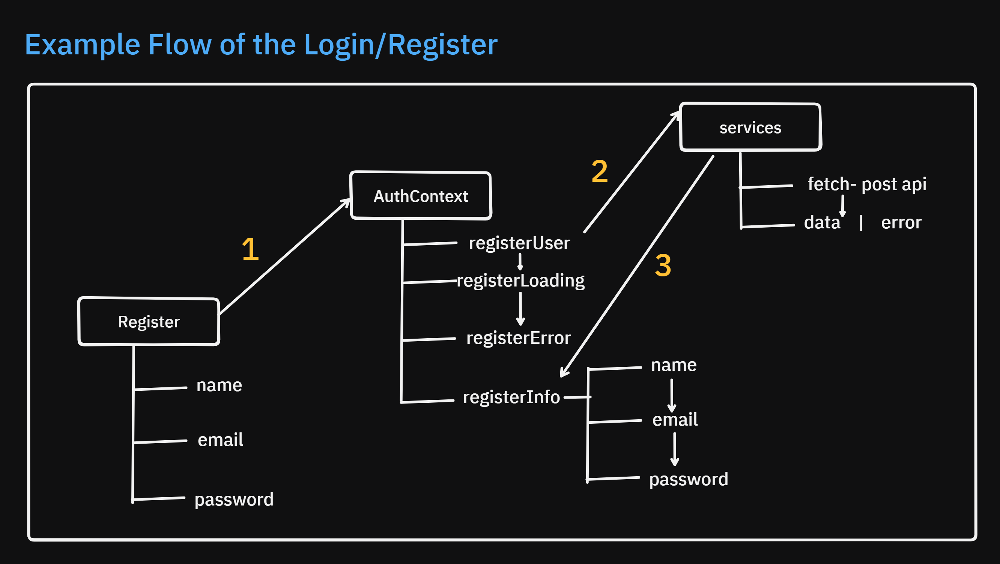
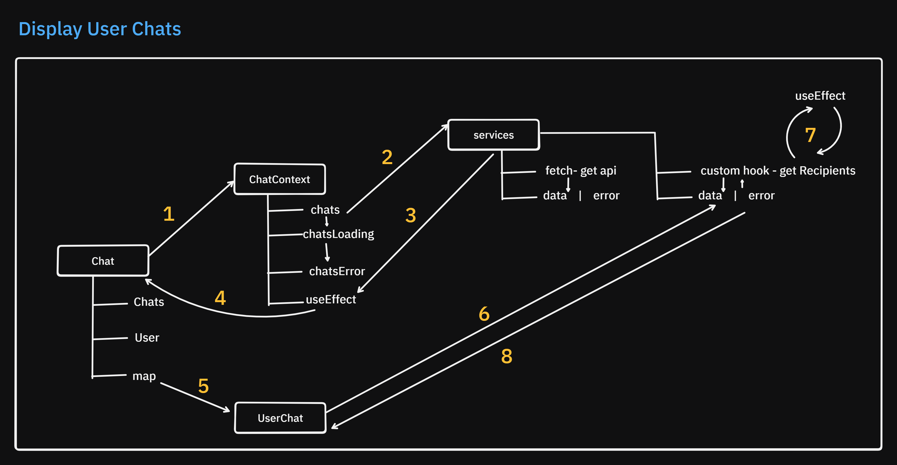
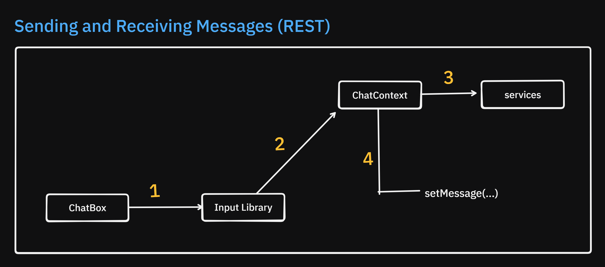
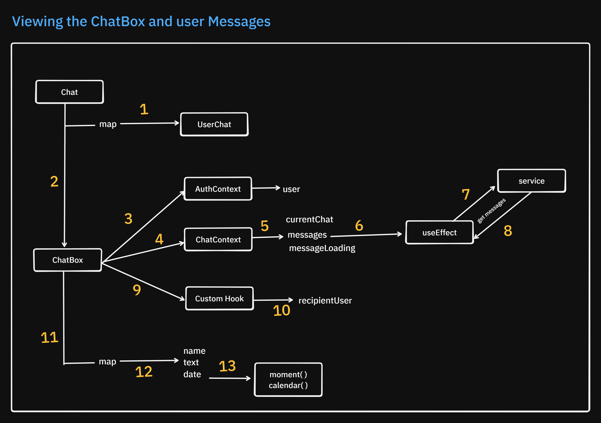
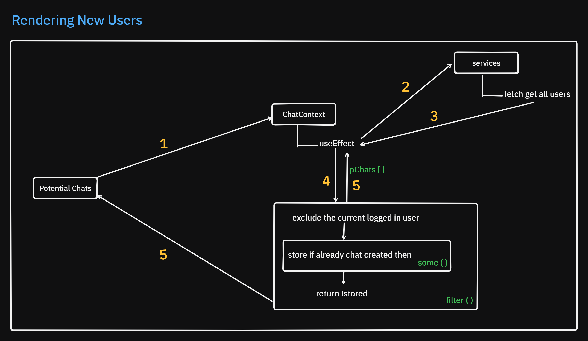
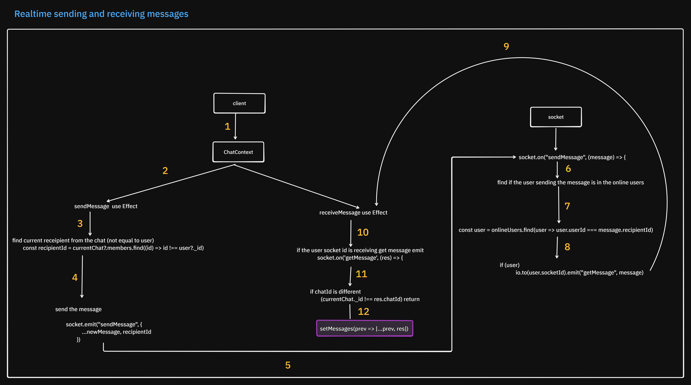
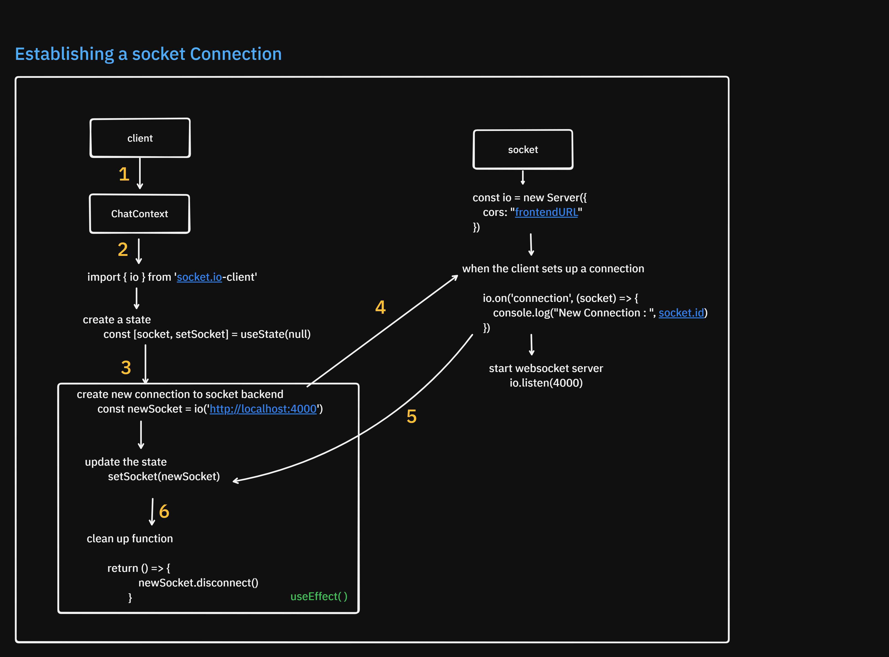
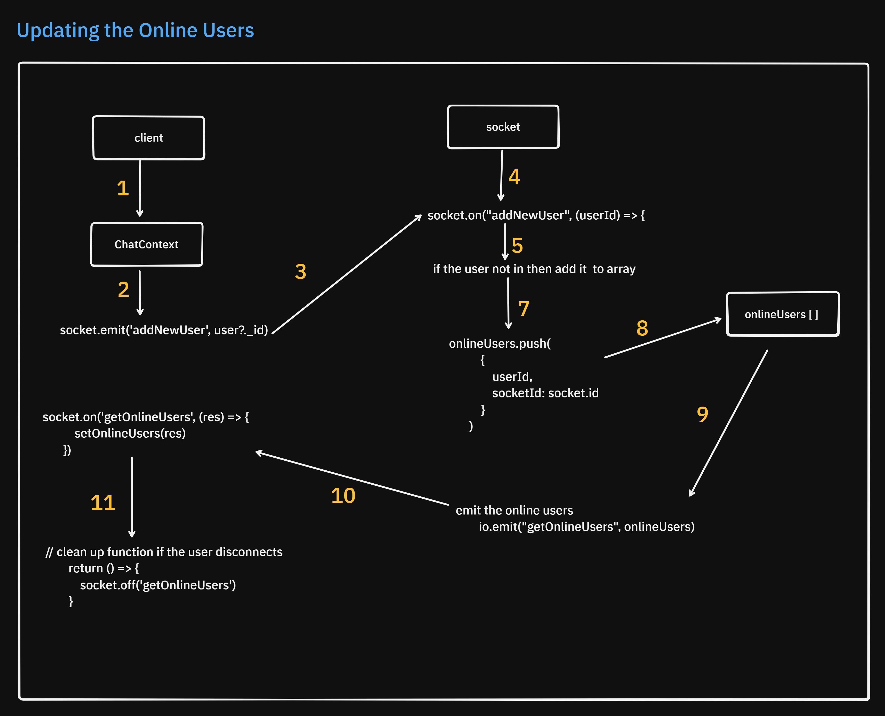
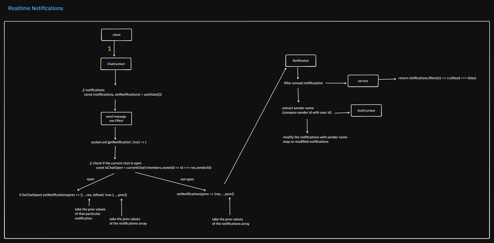

# 💬 Realtime Chat Application

A **full-stack realtime chat app** built with **React**, **Node.js**, **Express**, **MongoDB**, and **Socket.IO**. The app features **real-time private messaging**, **online user tracking**, **JWT authentication**, and **notifications**, using **custom APIs**, **context API**, and **custom hooks** for global state management.

---

## 🚀 Features Overview

- Authentication: Secure login and registration via JWT
- Realtime Messaging: Bi-directional communication with Socket.IO
- State Management: Using Context API and custom hooks
- RESTful APIs: Powered by Express.js
- Notifications: Instant in-app alerts for new messages
- Custom Hooks: For API calls, state updates, and effects
- Online Users: Real-time online/offline status

---

## 👜 Assets

#### Demo Video: [Watch](https://drive.google.com/file/d/1R8eaWQidZPMYO3YAbnOxrRZOr6hmLQ-7/view?usp=sharing)

#### Postman Collection: [Download here](https://github.com/YashChavanWeb/postman-collections/blob/main/chat-application/40041614-7220a1f3-06c3-47ae-83d2-0c66c4df589b.json)

---

## 🧩 Tech Stack

### Frontend

- React (Vite)
- React Router DOM
- Context API & Hooks
- Bootstrap + Google Fonts
- Socket.IO Client

### Backend

- Node.js + Express.js
- MongoDB + Mongoose
- JWT Authentication
- Socket.IO Server

---

## 🔧 Backend Setup

### Installation

```bash
npm install express mongoose dotenv cors jsonwebtoken bcrypt socket.io
```

### Structure

- `/models`
- `/routes`
- `/controllers`

### Authentication Flow

- Hash passwords in **User model**

- Endpoints:

  - `POST /register`
  - `POST /login`
  - `GET /users/:id`
  - `GET /users`

- Secure routes with JWT

**Fig1: Authentication**



### Chat Functionality

- **Chat schema** includes `members: [userId]`
- Endpoints:

  - `POST /chats`
  - `GET /chats/:userId`
  - `GET /chats`

**Fig2: User Chats**



### Message Functionality

- **Message schema** includes `chatId`, `senderId`, `text`, `timestamp`
- Endpoints:

  - `POST /messages`
  - `GET /messages/:chatId`

**Fig3: Send Messages**



---

## 🌐 Frontend Setup

### Initialize App

```bash
npm create vite@latest my-chat-app
```

### Pages

- `Login`, `Register`, `Home`, `Chat`

### Components

- `Navbar`, `ChatSidebar`, `ChatBox`, `UserList`

**Fig4: ChatBox**



### Styling

- Bootstrap + custom Google Font

---

## 🔐 Auth Context (Context API)

### Create Context

```js
import { createContext } from "react";
export const AuthContext = createContext();
```

### Provider Setup

```js
const [user, setUser] = useState(null);
<AuthContext.Provider value={{ user, setUser }}>
  {children}
</AuthContext.Provider>;
```

### Example Usage

```js
const { user } = useContext(AuthContext);
```

### Controlled Inputs with useCallback

```js
const updateRegisterInfo = useCallback((info) => {
  setRegisterInfo(info);
}, []);
```

---

## 🔌 Connecting Frontend to Backend

### API Utility Function

```js
const data = await response.json();
if (!response.ok) {
  return { error: true, message: data.message || data };
}
return data;
```

### Auth State

```js
const [registerInfo, setRegisterInfo] = useState({
  name: "",
  email: "",
  password: "",
});
```

### Call Auth Functions

```js
const { registerUser, registerError, isRegisterLoading } =
  useContext(AuthContext);
<Form onSubmit={registerUser}>
  {registerError?.error && <Alert>{registerError.message}</Alert>}
</Form>;
```

---

## 💬 Chat Functionality (Frontend)

### Global State with ChatContext

- Manage:

  - Current chat
  - Messages
  - Notifications

### Chat UI

- Sidebar: Existing chats + users
- Main: Messages + input field

**Fig5 : New Users**



**Fig6: Realtime Messages**



### Message Handling

- Custom hook for fetching messages
- Scroll to last message using `useRef`

```js
const scrollRef = useRef();
useEffect(() => {
  scrollRef.current?.scrollIntoView({ behavior: "smooth" });
}, [messages]);
```

---

## 🛰️ Socket.IO Integration

### REST API vs WebSocket

| REST API                 | WebSocket             |
| ------------------------ | --------------------- |
| Stateless                | Stateful              |
| Unidirectional           | Bidirectional         |
| Request-Response         | Event-driven          |
| Multiple TCP Connections | Single Persistent TCP |

---

### Server Socket.IO Setup

- Initialize `socket.io` on Express
- Events:

  - `connection`
  - `sendMessage`
  - `getMessage`
  - `getNotification`

**Fig7: Socket Connection**



### Frontend Socket Setup

```js
const socket = useRef();
useEffect(() => {
  socket.current = io("http://localhost:PORT");
  socket.current.emit("newUser", user._id);
}, []);
```

**Fig7: Online Users**



### Message & Notification Handling

```js
socket.current.on("getMessage", (message) => {
  setMessages((prev) => [...prev, message]);
});

socket.current.on("getNotification", (res) => {
  const isChatOpen = currentChat?.members.includes(res.senderId);
  setNotifications((prev) => [{ ...res, isRead: isChatOpen }, ...prev]);
});
```

**Fig8: Notifications**



---

### 🛠️ Potential Extensions

- Group Chats
- Media Sharing
- Typing Indicators
- Read Receipts
